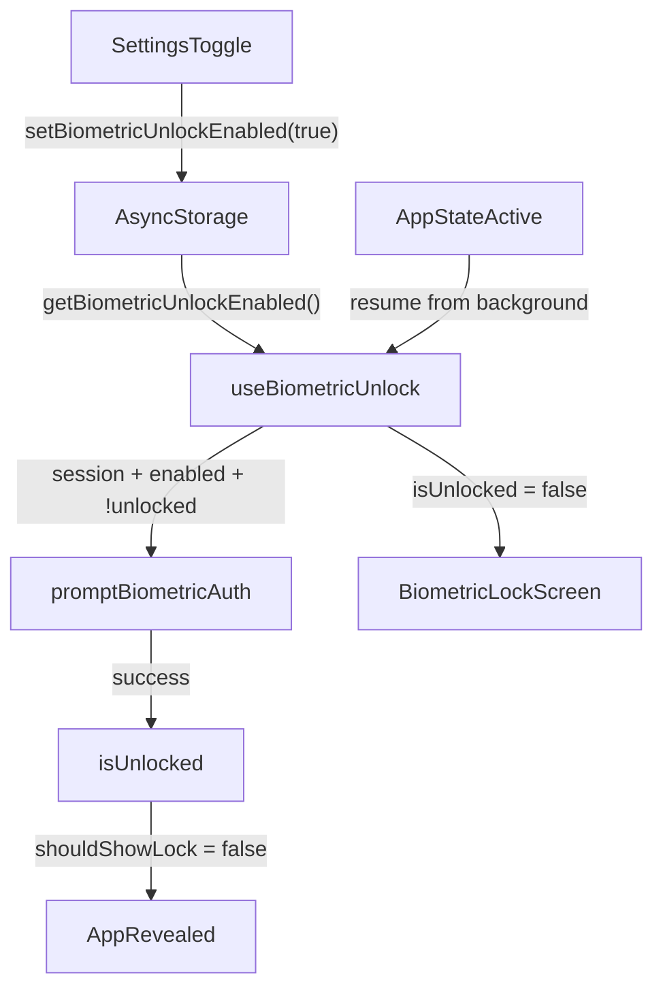

# Face ID Unlock Integration

## Important: Expo Go limitation

Face ID requires `NSFaceIDUsageDescription` in a native build. The toggle UI and AsyncStorage persistence can be built now, but the actual Face ID prompt will only fire after running `npx expo run:ios` to create a dev build on a Mac (or via EAS cloud build). Standard Expo Go is insufficient for end-to-end testing.

---

## Prerequisite — Supabase RLS (no change)

No Supabase changes needed. This feature is entirely client-side.

---

## Step 1 — Install package + update [`app.json`](app.json)

```bash
npx expo install expo-local-authentication
```

Add the plugin to `app.json` under `expo.plugins`:

```json
[
  "expo-local-authentication",
  {
    "faceIDPermission": "Waqt uses Face ID to unlock the app and protect your journal."
  }
]
```

---

## Step 2 — Create [`lib/biometric-preference.ts`](lib/biometric-preference.ts) (new file)

Single source of truth for the user's toggle preference, stored in AsyncStorage.

```ts
import AsyncStorage from '@react-native-async-storage/async-storage';

const KEY = '@waqt/biometric_unlock_enabled';

export async function getBiometricUnlockEnabled(): Promise<boolean> {
  const val = await AsyncStorage.getItem(KEY);
  return val === 'true';
}

export async function setBiometricUnlockEnabled(enabled: boolean): Promise<void> {
  await AsyncStorage.setItem(KEY, enabled ? 'true' : 'false');
}
```

---

## Step 3 — Create [`lib/local-authentication.ts`](lib/local-authentication.ts) (new file)

Thin wrapper around `expo-local-authentication` shared by settings and the lock gate.

- `checkBiometricSupport()` → `{ supported, enrolled }` using `hasHardwareAsync` + `isEnrolledAsync`
- `getBiometricLabel()` → `"Face ID"` / `"Touch ID"` / `"Biometric unlock"` from `supportedAuthenticationTypesAsync`
- `promptBiometricAuth(message?)` → calls `authenticateAsync({ disableDeviceFallback: false, fallbackLabel: 'Use Passcode' })`

---

## Step 4 — Create [`hooks/use-biometric-unlock.ts`](hooks/use-biometric-unlock.ts) (new file)

React hook that owns the lock state and re-lock on background. Consumed by `_layout.tsx`.

Inputs: `{ session: Session | null; initialized: boolean }`

Internal state: `preferenceLoaded`, `biometricEnabled`, `isUnlocked`, `isAuthenticating`, `lastError`

Effects:
1. On mount: read `getBiometricUnlockEnabled()` to hydrate `biometricEnabled`
2. Auto-prompt when `initialized && session && biometricEnabled && !isUnlocked` → call `promptBiometricAuth`
3. `AppState` listener: when app returns `active` from background → set `isUnlocked = false` → re-prompt

Returns: `{ shouldShowLock, biometricLabel, lastError, tryAgain, isAuthenticating }`

---

## Step 5 — Create [`components/biometric-lock-screen.tsx`](components/biometric-lock-screen.tsx) (new file)

Full-screen overlay matching the app's visual language (`#090921` background, `RadialBackground`, Cabin font, orange accent).

Props: `label`, `error`, `isAuthenticating`, `onTryAgain`, `onSignOut`

UI:
- `scan-outline` Ionicons icon
- Title: "Unlock Waqt"
- Subtitle: "Use {label} to continue"
- Error text when `lastError` set
- "Try Again" button → `onTryAgain`
- "Sign Out" text link → `supabase.auth.signOut()` (escape hatch)

Uses `StyleSheet.absoluteFillObject` to sit above the Stack navigator.

---

## Step 6 — Update [`app/_layout.tsx`](app/_layout.tsx)

Wire the hook and render the overlay after the Stack (same level as `AuthGate`):

```tsx
const biometric = useBiometricUnlock({ session, initialized });

// Inside return, after </Stack> and <AuthGate>:
{biometric.shouldShowLock && (
  <BiometricLockScreen
    label={biometric.biometricLabel}
    error={biometric.lastError}
    isAuthenticating={biometric.isAuthenticating}
    onTryAgain={biometric.tryAgain}
    onSignOut={() => supabase.auth.signOut()}
  />
)}
```

The lock only shows when `session !== null && biometricEnabled && !isUnlocked` — unauthenticated users on `/auth` are never blocked.

---

## Step 7 — Update [`app/settings.tsx`](app/settings.tsx)

Add a **Security** section (below Account, above Notifications):

- Row with `lock-closed-outline` icon and dynamic label from `getBiometricLabel()`
- `Switch` bound to local `biometricEnabled` state loaded from `getBiometricUnlockEnabled()` on mount
- On toggle **ON**: `checkBiometricSupport()` → if not enrolled show Alert and revert → else `promptBiometricAuth` to confirm → on success write `setBiometricUnlockEnabled(true)`
- On toggle **OFF**: `setBiometricUnlockEnabled(false)` immediately, no prompt
- If hardware not supported or not enrolled: `Switch` disabled with helper text beneath the row

---

## Data flow



---

## Scope

- [`app.json`](app.json) — plugin + permission string
- [`lib/biometric-preference.ts`](lib/biometric-preference.ts) — new file
- [`lib/local-authentication.ts`](lib/local-authentication.ts) — new file
- [`hooks/use-biometric-unlock.ts`](hooks/use-biometric-unlock.ts) — new file
- [`components/biometric-lock-screen.tsx`](components/biometric-lock-screen.tsx) — new file
- [`app/_layout.tsx`](app/_layout.tsx) — import hook + render overlay
- [`app/settings.tsx`](app/settings.tsx) — Security section + toggle
