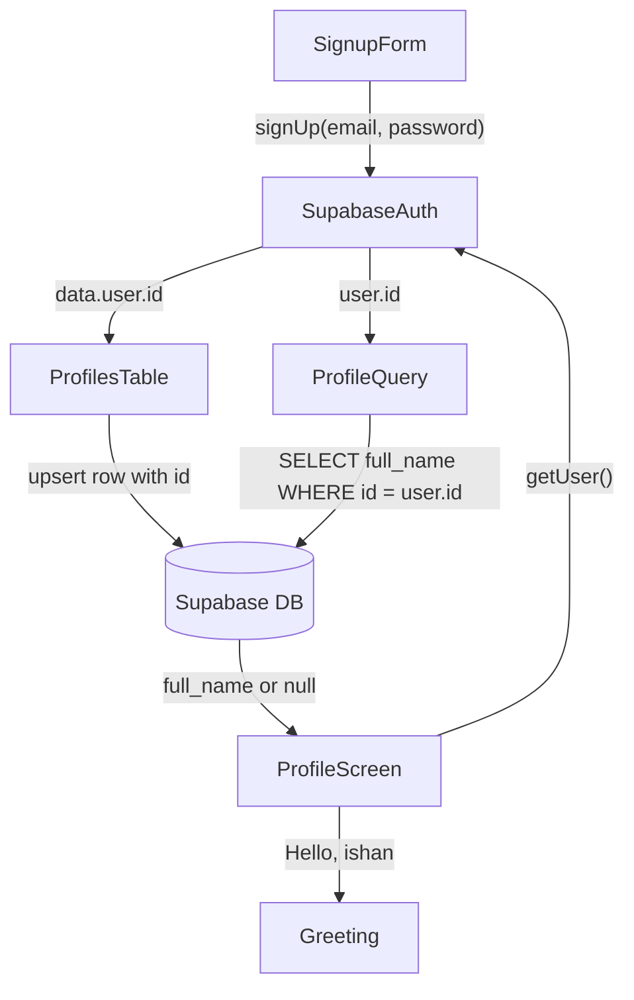

# Profile DB Integration

## Prerequisite — RLS policies (Supabase Dashboard, no code)

Before any code changes, verify these exist in Supabase Dashboard → Table Editor → `profiles` → RLS Policies. Without them every write silently fails.

- **INSERT policy**: `auth.uid() = id` — lets a user create their own profile row
- **SELECT policy**: `auth.uid() = id` — lets a user read their own profile row
- **UPDATE policy**: `auth.uid() = id` — lets a user update their own name later

If your partner has not set these up yet, ask them to do it first before testing the code below.

---

## Step 1 — [`app/auth.tsx`](app/auth.tsx): Create profile row on signup

### What changes
Destructure `data` from the `signUp` call (instead of only `error`), then `upsert` into `profiles` using the new user's ID. `upsert` is safer than `insert` — it won't crash if a row already exists (e.g. if the user signs up twice somehow).

### Current code (lines 87–92)
```tsx
const { error } = await supabase.auth.signUp({
  email: email.trim(),
  password,
});
if (error) setFeedback(error.message);
else setFeedback('Account created! Check your email to confirm, then log in.');
```

### Replacement
```tsx
const { data, error } = await supabase.auth.signUp({
  email: email.trim(),
  password,
});
if (error) {
  setFeedback(error.message);
} else {
  // Auto-create the profile row linked to the new auth user
  if (data.user) {
    await supabase.from('profiles').upsert({ id: data.user.id });
  }
  setFeedback('Account created! Check your email to confirm, then log in.');
}
```

No new imports needed — `supabase` is already imported.

---

## Step 2 — [`app/(tabs)/profile.tsx`](app/(tabs)/profile.tsx): Fetch and display real name

### What changes
- Add `useState` for `fullName`
- Add `useEffect` that runs once on mount: calls `supabase.auth.getUser()` to get the user's ID, then selects `full_name` from `profiles`
- If `full_name` is null (not set yet), fall back to the first part of their email (e.g. `ishan@gmail.com` → `ishan`)
- Replace the hardcoded `"Hello, Ishan"` with the fetched value

### New state + effect (add inside the component, before `if (!fontsLoaded)`)
```tsx
const [fullName, setFullName] = useState<string | null>(null);

useEffect(() => {
  async function fetchProfile() {
    const { data: { user } } = await supabase.auth.getUser();
    if (!user) return;
    const { data } = await supabase
      .from('profiles')
      .select('full_name')
      .eq('id', user.id)
      .single();
    // Use saved name, or fall back to the part of the email before @
    setFullName(data?.full_name ?? user.email?.split('@')[0] ?? null);
  }
  fetchProfile();
}, []);
```

### Updated greeting JSX (replace the hardcoded string)
```tsx
<Text style={styles.greeting}>Hello, {fullName ?? '...'}</Text>
```

### New import needed at the top of `profile.tsx`
```tsx
import React, { useEffect, useState } from 'react';
```
(`useEffect` and `useState` are not currently imported — `React` is already there so only the named imports need adding)

---

## Data flow



---

## Scope

- [`app/auth.tsx`](app/auth.tsx) — 4 line change in `handleEmailAuth`
- [`app/(tabs)/profile.tsx`](app/(tabs)/profile.tsx) — add `useState`, `useEffect`, update greeting
- No new files, no new packages
